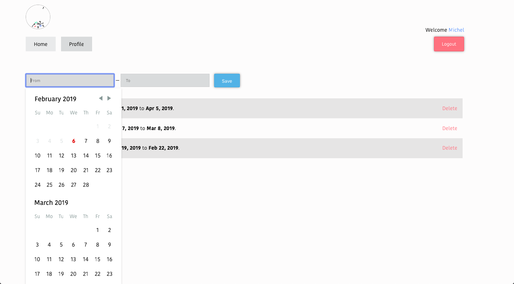
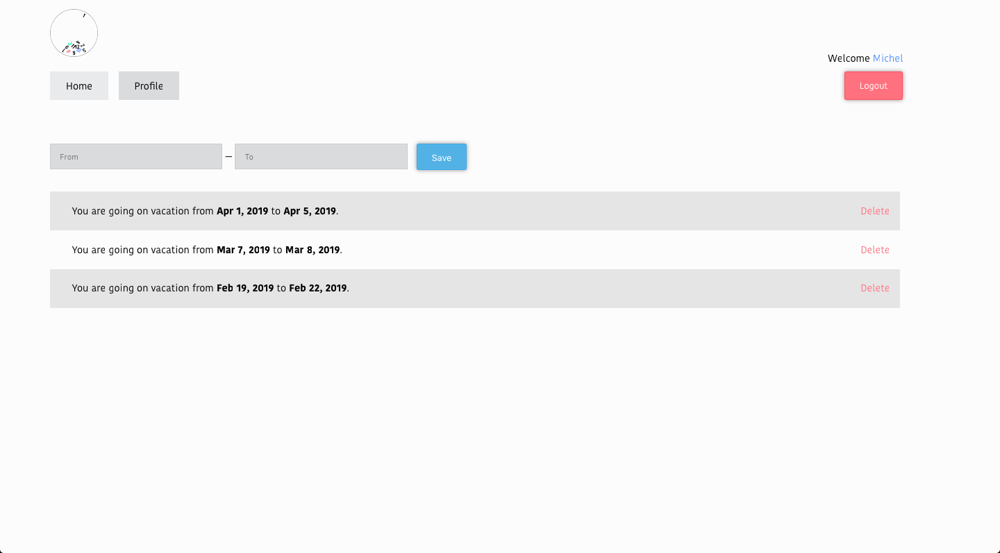
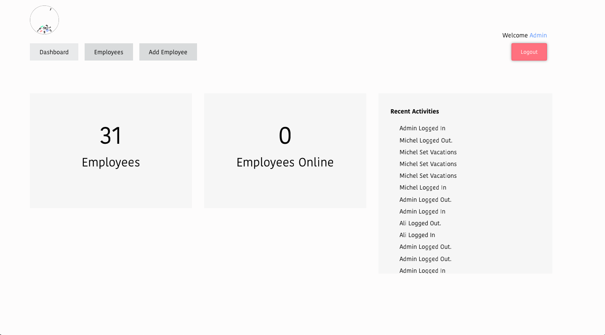
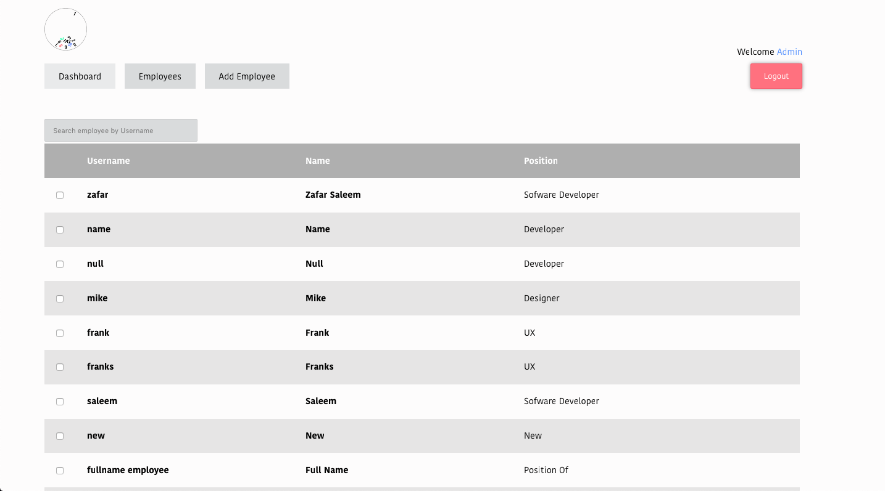
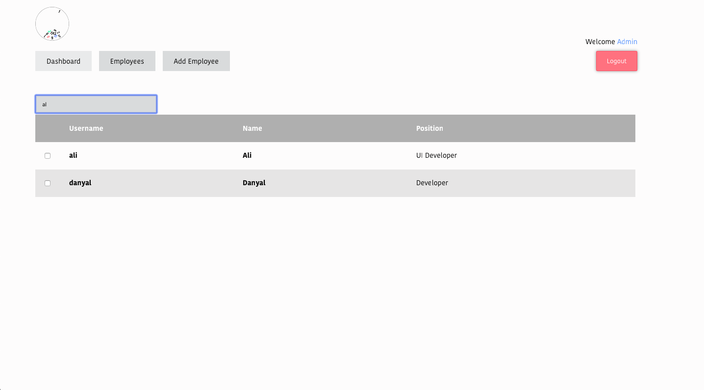
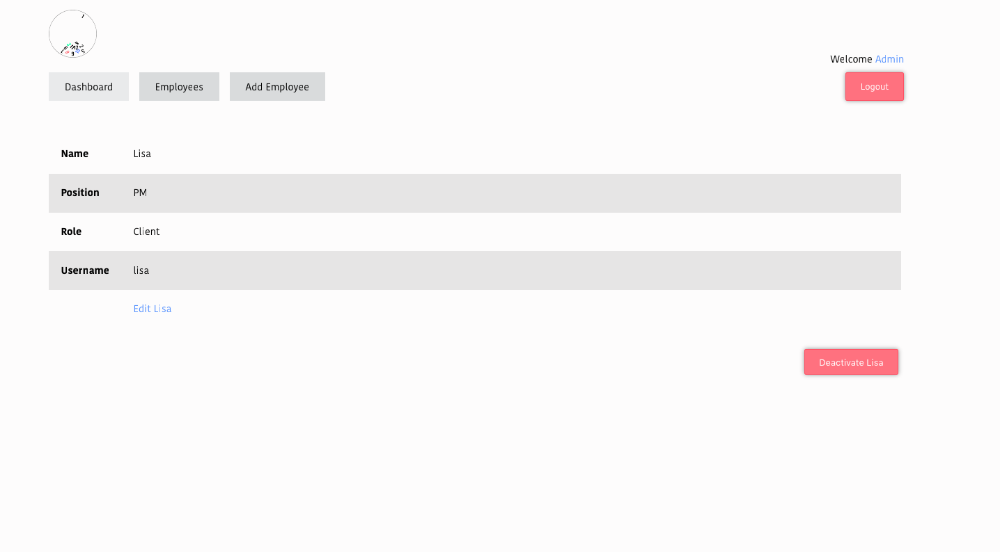

  

  <a target="_blank" href='https://www.facebook.com/TimeOff-325473081302189'>facebook</a> |
  <a target="_blank" href='https://twitter.com/TimeOff72858529'>twitter</a>

Note: This project requires to setup server side implementation which could be found [here](https://github.com/zafar-saleem/timeoff-server)

TimeOff is an application that allows companies and organisations to allow their employees to set vacations before they take their time off. 
TimeOff is an easy to use vacation setter with just few clicks. 

TimeOff is completely open source meaning companies can use this project and set it up either internally or in the cloud for their use.

In addition, it is completely customizable i.e. companies can customize its user interface as well as can add new features or remove for
their use.

It comes with minimalistic user interface as below:

### User Interface
TimeOff has a minimalistic user interface and easy to follow flow. With few clicks you are done with setting up your vacations.

### Want to see past vacations?
Right on the home page, you can view set of all your vacations both active and expired.

### View most important data right on home page
You want to see minimalist and amazing dashboard. On dashboard you can view all the required information you need.

### Finding and searching employees can never be so easy.
List of all employees are just one click away. Employees tab shows you all employees and search feature gives you find exact one you need.

### You have all the luxury to control any account.
That is right, you can control any person account you want as an Admin.

# Server Side of this project
This is the UI side of TimeOff. In order to use this UI you will need to setup it's server side which can be found on this link [TimeOff Serverside](https://github.com/zafar-saleem/timeoff-server).

# Technology Stack
For development team to set this project up for their companies use I provide the list of technologies used in this project.
* React
* Redux
* React Router
* Redux Saga

# Build for production
To build this project for production. Run `npm run build` command inside timeoff-app folder and it will generate the production ready project inside build directory. For details visit [deployment](https://facebook.github.io/create-react-app/docs/deployment) and [creating a production build](https://facebook.github.io/create-react-app/docs/production-build).

# Contributions
In order to contribute, please open issues and make pull requests.

# Design
The design(PSDs) could be found for this project on my [Uplab Profile](https://www.uplabs.com/posts/timeoff-to-schedule-vacations).

# Contact
timeoff.sendmail@gmail.com
